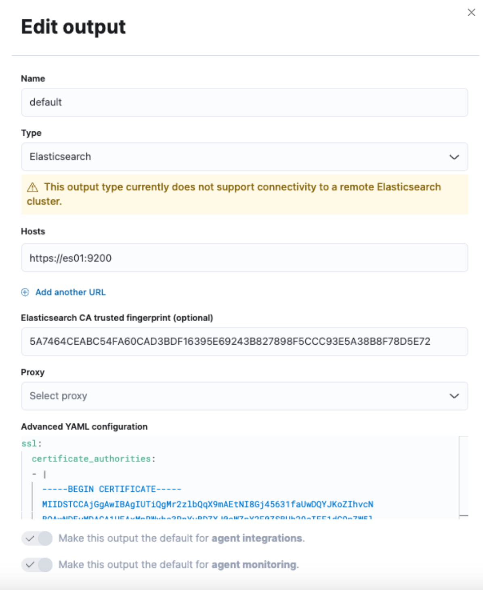

# HIS-ELK

The HIS-ELK project is designed to automatically monitor Hospital Information System (HIS) services and server statuses. By integrating the ELK (Elasticsearch, Logstash, Kibana) stack, this system streamlines data retrieval and visualization, facilitating efficient monitoring and analysis of HIS performance and issues.

## Table of Contents
- [ELK introduction](#elk-introduction)
- [HIS-ELK System Structure](#his-elk-system-structure)
- [Features](#features)
- [Install ELK Master](#install-elk-master)
- [Deploy ELK Client to VM](#deploy-elk-client-to-vm)
  - [Environment Check](#environment-check)
  - [Install Elastic Agent](#install-elastic-agent)
  - [PostgreSQL User Setting](#postgresql-user-setting)
- [Install Java Agent](#install-java-agent)
- [Configuration](#configuration)
- [Usage](#usage)
- [Contributing](#contributing)
- [License](#license)

## ELK introduction
The ELK stack, consisting of Elasticsearch, Logstash, and Kibana, is a powerful solution for real-time data analysis and visualization.
- Elasticsearch: A distributed search and analytics engine for storing and indexing data.
- Logstash: A data processing pipeline that ingests, transforms, and sends data to Elasticsearch.
- Kibana: A visualization tool for exploring and interacting with data stored in Elasticsearch.

Together, they enable comprehensive log and event data analysis, making it easier to monitor applications, troubleshoot issues, and gain insights. The ELK stack is scalable, flexible, and widely used for its powerful capabilities in handling large volumes of data efficiently.

This is a sort ppt for introduction [PPT](https://gamma.app/docs/HIS-ELK-4q9fkxld3pgwf9w).


## HIS-ELK System Structure


The diagram above illustrates the system architecture of the HIS-ELK integration, showcasing how data flows from the Hospital Information System through Logstash, is indexed in Elasticsearch, and finally visualized in Kibana.

## Features
- **Automated Data Requests:** Periodically requests data from the ELK stack.
- **Data Processing:** Cleans and processes the data for analysis.
- **Visualization:** Generates visual reports and dashboards using Kibana.
- **Scheduling:** Automates the report generation process on a weekly basis.

## Install ELK Master
- Docker and Docker Compose installed
- Clone the repository: `git clone https://github.com/aston668334/HIS-ELK.git`

This project is based on this blog [Elastic blog post](https://www.elastic.co/blog/getting-started-with-the-elastic-stack-and-docker-compose-part-2).

### Setup

#### Step 1: Build and Run the Containers
```sh
cd HIS-ELK
docker-compose up --build -d
```

#### Step 2: Generate and Copy Certificates

```sh
docker cp es-cluster-es01-1:/usr/share/elasticsearch/config/certs/ca/ca.crt /tmp/.
openssl x509 -fingerprint -sha256 -noout -in /tmp/ca.crt | awk -F"=" {' print $2 '} | sed s/://g
cat /tmp/ca.crt
```
#### Step 3: Configure Kibana Fleet Settings

1. Access Kibana and navigate to Fleet settings

2. Add the Elasticsearch host and certificate fingerprint

3. Save and deploy the settings


**Cert must start with**
```bash
ssl:
certificate_authorities:
- |
```

#### Step 4: Interact with the Web Application

Open your browser and go to http://localhost:9200


## Deploy ELK Client to VM

### ADD fleet server

Click **Action**and set Name( what ever you want) add URL (ex. https://192.168.101.11:8220)


### Environment Check
Ensure the VM can connect to the ELK master (192.168.101.11).

### Install Elastic Agent
1. **Add Agent Policies (optional):** Follow the link to [add agent policies](https://kibana.mspbs.gov.py/app/fleet/policies).
2. **Enroll Agent:**
   - Select policies and choose [Enroll in Fleet (recommended)].
   - Copy the command from [this link](https://kibana.mspbs.gov.py/app/fleet/agents) and run it on your VM.

**Add insecure flag to the command:**
```bash
sudo ./elastic-agent install --url=https://192.168.101.11:8220 --enrollment-token=your_token  --insecure
```
### PostgreSQL User Setting
Set the username and password in Agent policies:

**Navigate to your policy.**

1. Go to PostgreSQL -> Collect PostgreSQL metrics -> Settings.
2. Set the username and password.


### Java services APM

1. Download the elastic-apm-agent:

```bash
curl "https://oss.sonatype.org/service/local/repositories/snapshots/content/co/elastic/apm/elastic-apm-agent/1.49.1-SNAPSHOT/elastic-apm-agent-1.49.1-20240429.100006-21.jar" -o /usr/local/apm/elastic-apm-agent.jar
```

2. Add the following to your Java environment:

```bash
-javaagent:/usr/local/apm/elastic-apm-agent.jar
```

3. Set the following environment variable in your ENV file:

```env
ELASTIC_APM_SERVER_URL=http://localhost:8200
```

# Contributing
We welcome contributions to improve this project! Please fork the repository and create a pull request with your changes.

## License
This project is licensed under the Apache License. See the [LICENSE](LICENSE) file for details.
